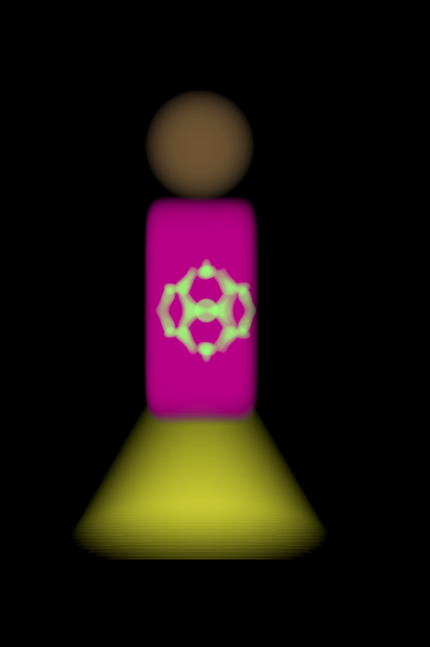
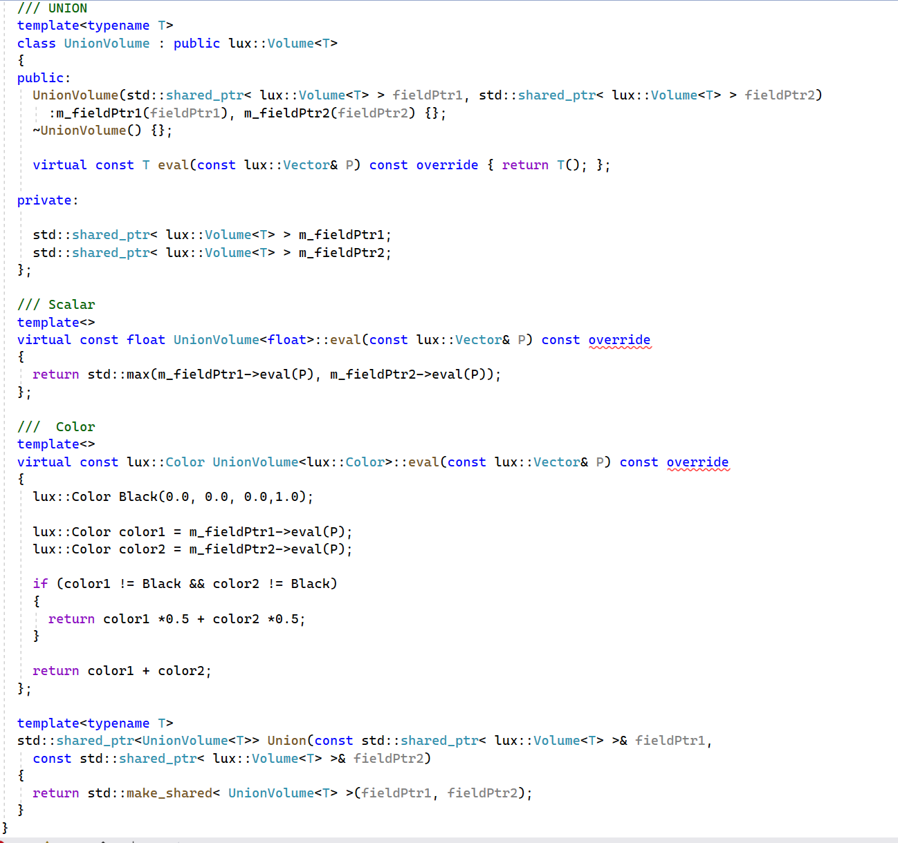
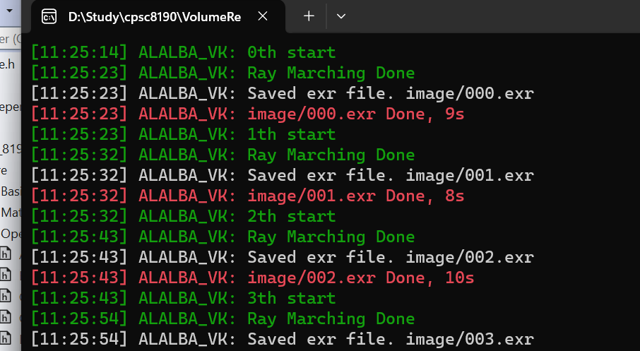

### 1. current progress

- [x] basic shapes

- [x] CSG operations : except for shell and blend

- [ ] humanoid

  

### CSG 

- UNION as example
- 

### Raymarcher

- input : camera, resolution, minimum transmissity , $\Delta s$,  $\kappa$,  

- RayMarcher::RayMarch

  - input: density field, color field

- RayMarcher::MarchSigleLight

  - input: ray index, density field, color field

  - near and far plane; if snear and sfar are constants for each ray, the near plane and the far plane will form an arc, not a plane

    

  - 

  - 

  

## HUMANOID

- Skirt as example

  

### Performance

- Rotation: use Transpose instead of Inverse. time consumption decreased from 16s to 12s

   no more need to calculate cofactor matrix for each element: $O(N^2)$ to $O(N)$

- pass smart pointer by reference for all CSG operation: 12s -> 9s  

### Demo

### Unsolved Issues

- the order of CSG operation affects efficiency

  - Skirt for example,

     if I assign a color field to the sdf and then rotate the colorfield while rotating sdf . 

    time consumption from 9->8

- for some CSG operation:

  take union as example:

  passing shared_ptr by value makes app run faster than passing by reference: 

  9s -> 8s