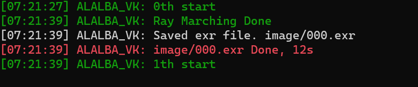
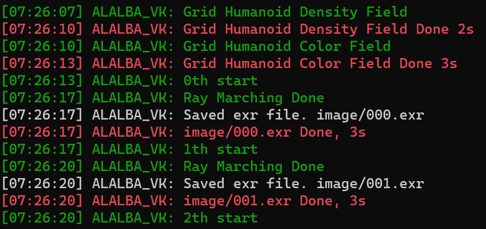
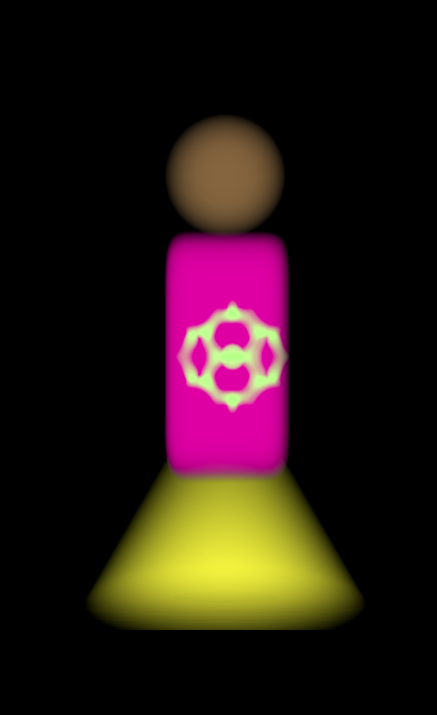
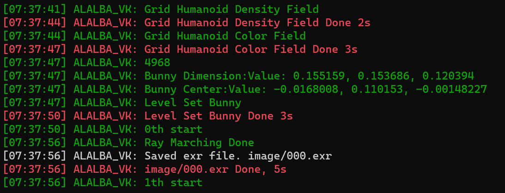
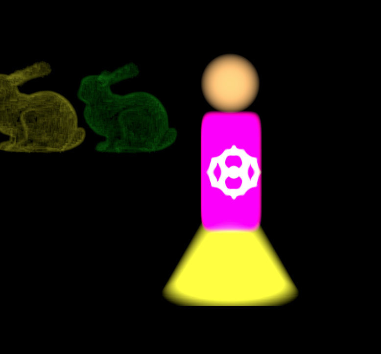
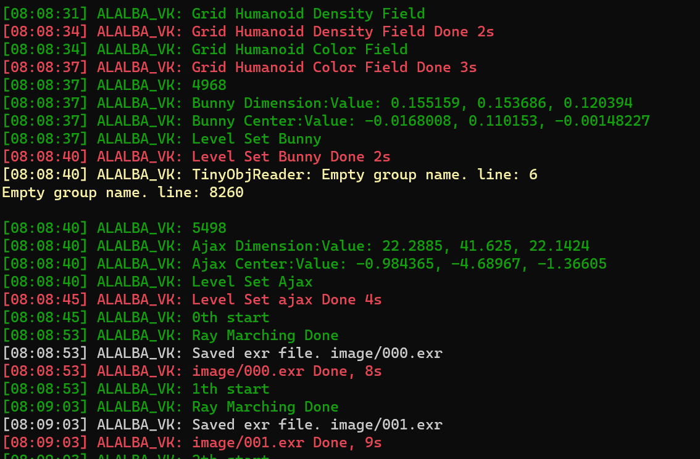
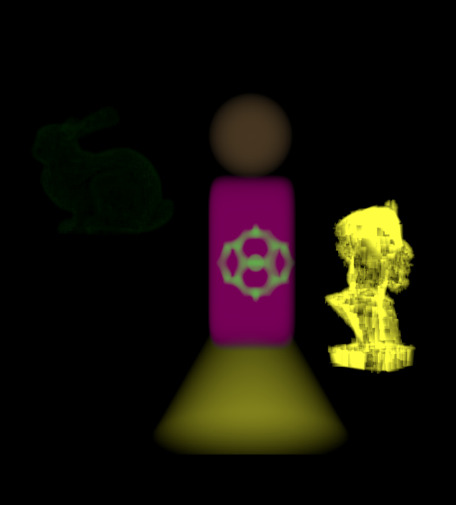
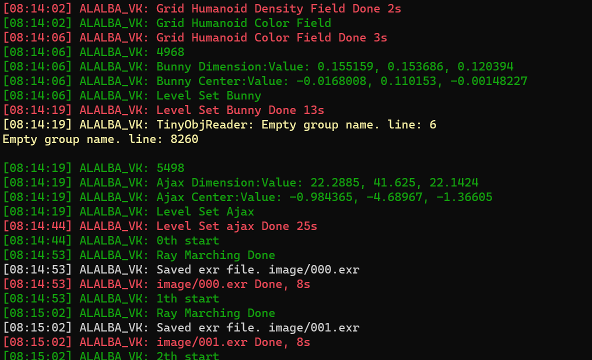
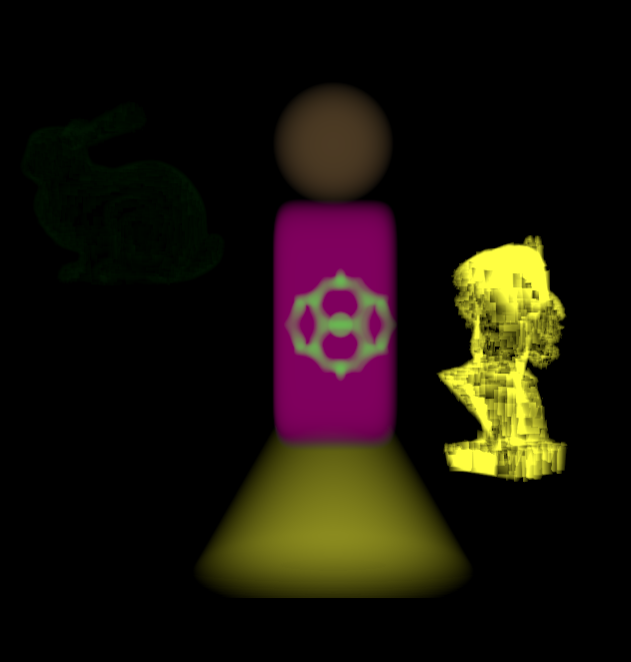
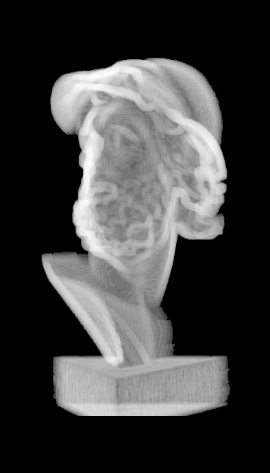

## Sparse Grid

ray marcher step size is $0.02$, whole scene size is $4.0^3$

- Humanoid Density Grid : $513^3$
- Humanoid Color Grid : $513^3$
- Block size for both  grids: $4^3$ 

#### Before

$12$ second for each frame

### After

- $3$ second each frame
- $2$ seconds for building density field, 3 sec for color 

## Level Set

### bunny

- Grid size for both density and color: $513^3$
- Block size : $8^3$
- Bandwidth: $4$ 

### AJAX and bunny

### Grid size to $1025^3$

### Light DSM

